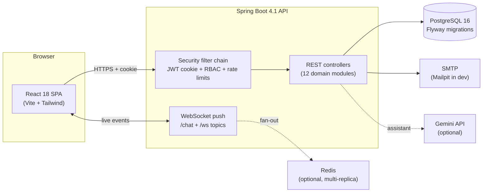

<div align="center">

# SkillSwap

**A peer-to-peer skill exchange platform — teach what you know, learn what you don't, settle up in credits instead of cash.**

[](https://github.com/ShyanCS/SkillxSwap/actions/workflows/ci.yml)
[](https://github.com/ShyanCS/SkillxSwap/releases)
[](LICENSE)
[](https://skillx-swap.vercel.app)

</div>

Members list a skill they can teach and a skill they want to learn. A rule-based
matching engine finds reciprocal pairs, sessions are scheduled against real
availability, and each completed session transfers one Skill Credit from learner
to teacher — a closed-loop economy where the only way to earn learning time is
to teach.

## Why this exists

Barter-style skill exchange shows up everywhere in the real world — university
clubs trading coding for design help, coworking spaces running "skill swap
Sundays", open-source communities pairing mentors, or companies letting employees
teach each other instead of paying for courses. Almost all of it still runs on
spreadsheets and group chats. SkillSwap is the piece that's usually missing:

- **Discovery** — a categorized marketplace of who offers and wants what
- **Trust** — post-session reviews feeding public ratings
- **Fairness** — an append-only credit ledger so nobody's time goes unpaid

## Features

- **Auth** — registration with email OTP verification, login, password reset,
  JWT httpOnly-cookie sessions, role-based access (user/admin), account suspension
- **Profiles** — bio, region, timezone, photo (Cloudinary), public pages with ratings
- **Skill Marketplace** — categorized catalog; manage skills you offer or want
- **Matching Engine** — reciprocal matching with a 0–100% compatibility score
  weighted by shared free time; send / accept / reject requests
- **Availability** — weekly recurring windows per user's own timezone, compared
  as real instants so cross-zone partners see genuinely overlapping hours
- **Sessions** — schedule, cancel, complete; validated against both sides'
  availability and existing bookings
- **Credit Wallet** — starter balance, atomic transfer on completion,
  append-only transaction ledger
- **Ratings & Reviews** — gated on completed sessions, one per reviewer/session
- **Messaging** — 1:1 chat between matched users over WebSocket, with unread
  counts, read receipts, and paged history
- **Notifications** — in-app + email alerts, pushed live to open tabs
- **Study Assistant** — optional Gemini-backed help scoped to your skills
- **Admin Panel** — platform stats, suspension, catalog management, user reports

## Architecture



| Layer | Technology |
|---|---|
| Frontend | React 18 + Vite + Tailwind CSS, nginx in production |
| Backend | Spring Boot 4.1 (Java 17), Spring Security (JWT), Spring Data JPA |
| Database | PostgreSQL 16, schema versioned with Flyway |
| Realtime | WebSocket push (`/ws`), authenticated by the same JWT cookie as REST |
| Tests | JUnit 5 + Testcontainers (real Postgres); Vitest + Testing Library |
| Email | JavaMail over SMTP (Mailpit locally) |
| Optional | Redis (multi-replica scaling), Gemini (AI assistant), Cloudinary (photos) |

## Quick start

**Prerequisites:** Docker. (Java 17 + Node.js only for native development.)

### One command, whole product

```bash
docker compose -f docker-compose.dev.yml up --build
```

Then open:

| URL | What |
|---|---|
| http://localhost:3000 | The app |
| http://localhost:8080/actuator/health | API health |
| http://localhost:8025 | Mailpit — OTP codes land here |

No configuration needed. This mode builds images, so for day-to-day development
the faster setup is:

```bash
# 1. Infrastructure only (Postgres on :5433 + Mailpit on :8025)
cd backend-java && docker compose up -d

# 2. API on :8080
./mvnw spring-boot:run

# 3. Frontend on :5173
cd ../frontend && npm ci && npm run dev
```

Dev defaults live in `backend-java/src/main/resources/application-dev.yml` — no
`.env` required. Enable the AI assistant locally with
`AI_ENABLED=true GEMINI_API_KEY=... ./mvnw spring-boot:run`.

## Testing

Every check CI enforces runs locally too:

```bash
# Backend: integration tests against a real PostgreSQL container,
# Spotless formatting, JaCoCo coverage report (Docker must be running)
cd backend-java && ./mvnw verify

# Frontend: Vitest suite with coverage thresholds
cd frontend && npm test

# Formatting
cd frontend && npm run format:check     # `npm run format` to fix
cd backend-java && ./mvnw spotless:apply # Java formatting to fix
```

Backend tests boot the actual Flyway migrations with `ddl-auto: validate`, so an
entity drifting from its migration fails the build. Coverage concentrates on the
invariants worth breaking builds over: credit transfers happen exactly once and
stay balanced, role/suspension boundaries hold, and scheduling survives
cross-timezone cases.

CI additionally gates on `npm audit` (critical), an OWASP dependency-check scan
(CVSS ≥ 9 fails the build), an explicit Flyway migrate+validate pass against a
scratch database, lint, tests, coverage floors, formatting, and Docker image builds.

## Production deployment

```bash
cp .env.example .env      # fill in real values
docker compose -f docker-compose.prod.yml up -d --build
```

Starts Postgres (internal-only networking), the API, and the nginx-served
frontend. **Put a TLS-terminating reverse proxy in front** — production forces
`Secure` cookies and will not work over plaintext HTTP.

The backend refuses unsafe startup rather than booting insecurely: missing or
weak `JWT_SECRET`, leftover dev secrets, missing database password, or wildcard
CORS all abort boot. Every variable is documented in `.env.example`.

Worth knowing:

- `VITE_API_BASE_URL` is baked into the bundle at build time — changing it means
  rebuilding the web image.
- `COOKIE_SAME_SITE=Lax` fits frontend and API sharing a registrable domain;
  use `None` only across genuinely different domains.
- Your reverse proxy must forward WebSocket upgrades to `/ws`, or chat silently
  falls back to polling.
- Set `ADMIN_BOOTSTRAP_EMAIL` to a registered account; it is promoted to ADMIN
  on next start.

Running more than one replica? Set `REDIS_ENABLED=true` and start with
`--profile scale` — Redis shares rate-limit buckets and WebSocket fan-out that
would otherwise be per-process. Health probes are exposed at
`/actuator/health/{liveness,readiness}`.

## Project structure

```
frontend/                   React SPA (Vite) + nginx config + Dockerfile
  src/lib/                    logger, zod validation schemas
  src/contexts/               state + API access per domain
  src/components/             shared UI (ErrorBanner, skills, profile)
backend-java/
  src/main/java/com/skillswap/backend/
    auth/                       registration, login, JWT, OTP
    profile/ skill/ matching/   profiles, catalog, matching engine
    availability/ session/      timezone-aware windows, scheduling
    wallet/ review/             credit ledger, ratings
    messaging/ notification/    WebSocket chat, dispatch
    realtime/ dashboard/ ai/ admin/ report/
    common/                     rate limiting, request ids, mail, errors
  src/main/resources/db/migration/   Flyway SQL (+ lineage README)
  src/test/                          Testcontainers integration suite
docker-compose.dev.yml      zero-config full stack for evaluation
docker-compose.prod.yml     production stack
.github/workflows/ci.yml    lint, tests, coverage, audits, migrations, images
```

## Roadmap

- Session reminder notifications ahead of scheduled times
- One-off availability exceptions (holidays) alongside weekly patterns
- Full-text search over the skill catalog
- Account deletion flow
- Incremental adoption of the React Compiler rules currently warn-gated

Known limitations are tracked honestly rather than hidden; see the release notes
and `CHANGELOG.md`.

## Contributing

PRs welcome — please read [CONTRIBUTING.md](CONTRIBUTING.md) first. It covers
environment setup, every check your change must pass, commit conventions
(one concern + its tests), and database-change rules. Security-relevant bugs:
please open an issue rather than a public PR if the detail is sensitive.

## License

Released under the [MIT License](LICENSE).
